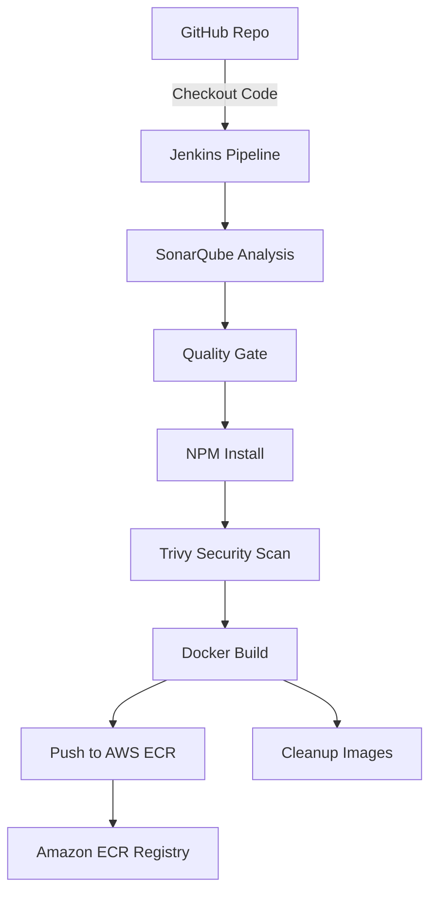

# Cloud-Based CI/CD Pipeline on AWS

## 📌 Project Overview

This project demonstrates building a **CI/CD pipeline on AWS** using Terraform, Jenkins, and security scanning tools. The pipeline automates source code checkout, quality checks, Docker image build, and deployment to AWS ECR.

**Tools & Technologies**:

- **Infrastructure**: Terraform, AWS (EC2, ECR)
- **CI/CD**: Jenkins, GitHub
- **Security & Quality**: SonarQube, Aqua Trivy
- **Containerization**: Docker
- **Language/Runtime**: Java, NPM, AWS CLI, Linux

---

## ⚙️ Infrastructure Setup

1. Provision AWS infrastructure (EC2, ECR) with **Terraform**.
2. Install and configure on EC2:
   - Jenkins
   - Docker
   - SonarQube
   - Aqua Trivy
   - Java + AWS CLI

---

## 🚀 CI/CD Pipeline Workflow

1. **Checkout Code** – Pull source from GitHub.
2. **SonarQube Analysis** – Perform static code analysis.
3. **Quality Gate** – Validate code quality.
4. **NPM Install** – Install project dependencies.
5. **Trivy Scan** – Scan code for vulnerabilities.
6. **Docker Build** – Build Docker image.
7. **Push to AWS ECR** – Push image (tagged with build number + latest).
8. **Cleanup** – Remove images from Jenkins node to save space.

---

## 📜 Jenkinsfile (Pipeline Script)

```groovy
pipeline {
    agent any

    parameters {
        string(name: 'ECR_REPO_NAME', defaultValue: 'thanhtam-ecr', description: 'Enter repository name')
        string(name: 'AWS_ACCOUNT_ID', defaultValue: '299195674927', description: 'Enter AWS Account ID') // Added missing quote
    }

    tools {
        jdk 'JDK17'
        nodejs 'NodeJS'
    }

    environment {
        SCANNER_HOME = tool 'SonarQube Scanner'
    }

    stages {
        stage('1. Git Checkout') {
            steps {
                git branch: 'main', url: 'your-repo'
            }
        }

        stage('2. SonarQube Analysis') {
            steps {
                withSonarQubeEnv ('sonar-server') {
                    sh """
                    $SCANNER_HOME/bin/sonar-scanner \
                    -Dsonar.projectName=amazon-prime \
                    -Dsonar.projectKey=amazon-prime
                    """
                }
            }
        }

        stage('3. Quality Gate') {
            steps {
                waitForQualityGate abortPipeline: false,
                credentialsId: 'sonar-token'
            }
        }

        stage('4. Install npm') {
            steps {
                sh "npm install"
            }
        }

        stage('5. Trivy Scan') {
            steps {
                sh "trivy fs . > trivy.txt"
            }
        }

        stage('6. Build Docker Image') {
            steps {
                sh "docker build -t ${params.ECR_REPO_NAME} ."
            }
        }

        stage('7. Create ECR repo') {
            steps {
                withCredentials([string(credentialsId: 'Thanh_Tam_access_key', variable: 'AWS_ACCESS_KEY'),
                                 string(credentialsId: 'Thanh_Tam_secret_access_key', variable: 'AWS_SECRET_KEY')]) {
                    sh """
                    aws configure set aws_access_key_id $AWS_ACCESS_KEY
                    aws configure set aws_secret_access_key $AWS_SECRET_KEY
                    aws ecr describe-repositories --repository-names ${params.ECR_REPO_NAME} --region us-east-1 || \
                    aws ecr create-repository --repository-name ${params.ECR_REPO_NAME} --region us-east-1
                    """
                }
            }
        }

        stage('8. Login to ECR & tag image') {
            steps {
                withCredentials([string(credentialsId: 'Thanh_Tam_access_key', variable: 'AWS_ACCESS_KEY'),
                                 string(credentialsId: 'Thanh_Tam_secret_access_key', variable: 'AWS_SECRET_KEY')]) {
                    sh """
                    aws ecr get-login-password --region us-east-1 | docker login --username AWS --password-stdin ${params.AWS_ACCOUNT_ID}.dkr.ecr.us-east-1.amazonaws.com
                    docker tag ${params.ECR_REPO_NAME} ${params.AWS_ACCOUNT_ID}.dkr.ecr.us-east-1.amazonaws.com/${params.ECR_REPO_NAME}:${BUILD_NUMBER}
                    docker tag ${params.ECR_REPO_NAME} ${params.AWS_ACCOUNT_ID}.dkr.ecr.us-east-1.amazonaws.com/${params.ECR_REPO_NAME}:latest
                    """
                }
            }
        }

        stage('9. Push image to ECR') {
            steps {
                withCredentials([string(credentialsId: 'Thanh_Tam_access_key', variable: 'AWS_ACCESS_KEY'),
                                 string(credentialsId: 'Thanh_Tam_secret_access_key', variable: 'AWS_SECRET_KEY')]) {
                    sh """
                    docker push ${params.AWS_ACCOUNT_ID}.dkr.ecr.us-east-1.amazonaws.com/${params.ECR_REPO_NAME}:${BUILD_NUMBER}
                    docker push ${params.AWS_ACCOUNT_ID}.dkr.ecr.us-east-1.amazonaws.com/${params.ECR_REPO_NAME}:latest
                    """
                }
            }
        }

        stage('10. Cleanup Images') {
            steps {
                sh """
                docker rmi ${params.AWS_ACCOUNT_ID}.dkr.ecr.us-east-1.amazonaws.com/${params.ECR_REPO_NAME}:${BUILD_NUMBER}
                docker rmi ${params.AWS_ACCOUNT_ID}.dkr.ecr.us-east-1.amazonaws.com/${params.ECR_REPO_NAME}:latest
		docker images
                """
            }
        }
    }
}

```

---

## 📊 Architecture Diagram



---

## ✅ Outcome

- Fully automated CI/CD pipeline on AWS.
- Integrated static code analysis (SonarQube) and vulnerability scanning (Trivy).
- Built and pushed Docker images to AWS ECR.
